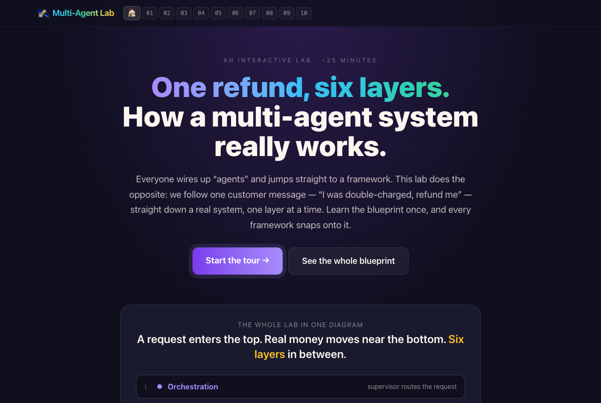
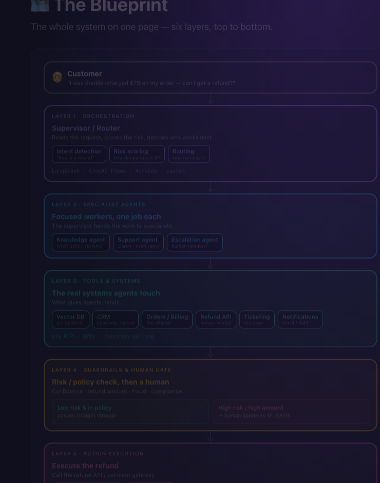
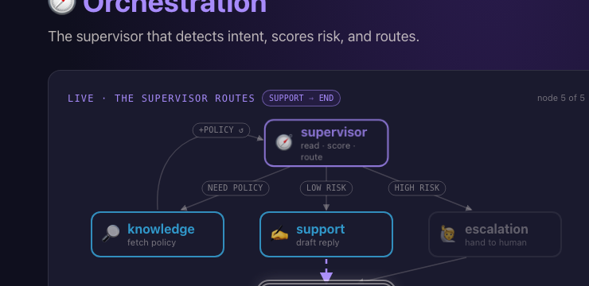
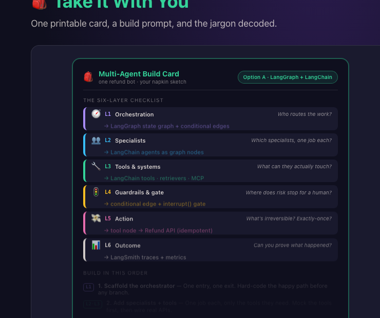

<div align="center">

# 🛰️ Multi-Agent Explain Lab

### A 25-minute interactive tour of how a multi-agent AI system *actually* works.

**No code. No math. No API keys. One refund, six layers.**

[**▶ Try it live →**](https://lionellau.github.io/multi-agent-explain-lab)

<sub>Built by a mentor who got tired of drawing the same six boxes on the whiteboard.</sub>



</div>

---

## Why this exists

I mentor engineers and a few non-engineers who want to build with AI. Once agents got popular, the same two questions started showing up every week:

> *"Should I use LangGraph, or CrewAI, or AutoGen?"*
> *"How do I actually build an agent that does my job for me?"*

I noticed almost everyone starts from the **framework** and bends their problem to fit it. That is backwards. The framework is the *last* decision, not the first.

So I tried a different answer. Instead of "here are five tools," I drew one real system end to end: a **customer support refund bot**. One message comes in, "I was double-charged $79, refund me," and you follow it down through every layer until real money moves and a receipt comes out.

Once you can see those layers, every framework stops being scary. LangGraph, CrewAI, AutoGen, MCP — each one is just a tool that lives in one of the layers you already understand.

This lab is that walk-through, made interactive. It is free, MIT-licensed, and runs entirely in your browser. Nothing leaves your machine.

---

## Who it's for

- You can use ChatGPT, but you have never built an "agent" and the jargon feels like a wall.
- You keep hearing **multi-agent**, **MCP**, **LangGraph**, **guardrails** and want the *map* before you pick a tool.
- You are a domain expert (support, ops, finance) who wants to **sketch your own agentic system** after one sitting.
- You teach this stuff and want something concrete to point people at.

If you want a clear, no-math answer to *"how does a multi-agent system actually work, and where do I start?"* — this is for you.

---

## What you'll learn (about 25 minutes)

The lab follows one refund, top to bottom. Each chapter is one prominent **📖 Explanation** panel paired with a live, scripted animation. You read, watch the diagram move, then press **Next** when ready. No quizzes. No friction.

| # | Chapter | The idea you walk away with |
|---|---|---|
| 01 | **Why Multi-Agent?** | One agent is the honest default. A second agent is a real cost — it has to earn its place. |
| 02 | **The Blueprint** | The whole system on one page: six layers, a customer message at the top, real money near the bottom. |
| 03 | **Orchestration** | One supervisor reads the request, scores risk, and routes it. This is where LangGraph / CrewAI Flows / AutoGen live. |
| 04 | **Specialist Agents** | Focused workers with one job each: fetch policy, draft the reply, decide escalation. |
| 05 | **Tools & Systems** | How an agent reaches real systems — the CRM, the billing API — via function calls and **MCP**. |
| 06 | **Guardrails & Human Gate** | The risk check that stops a refund for a human before any money moves. Autonomy is a dial, not a switch. |
| 07 | **Action Execution** | The one irreversible step. How an idempotency key keeps a retry from paying twice. |
| 08 | **Outcome & Observability** | The receipt and the audit trail. The difference between "it ran" and "we can stand behind it." |
| 09 | **Framework Placement** | Same six layers, three real stacks (LangGraph+LangChain / CrewAI / Microsoft+AutoGen). And: do you even need multi-agent? |
| 10 | **Take It With You** | A printable build card, a prompt to paste into your AI assistant to scaffold it, and a five-term glossary. |

The one rule the whole lab keeps repeating: **choose the architecture first, then pick a framework to express it. Never the other way around.**

---

## A peek inside

<table>
<tr>
<td width="50%">

**The Blueprint — six layers, one refund**



</td>
<td width="50%">

**Orchestration — the supervisor routes the work**



</td>
</tr>
<tr>
<td colspan="2">

**Take It With You — the whole lab on one card you can copy, print, or hand to your AI assistant**



</td>
</tr>
</table>

---

## The one big idea

Every agentic system, however fancy, is six questions stacked top to bottom:

1. **Orchestration** — who routes the work?
2. **Specialists** — which agents, each with one job?
3. **Tools** — what can they actually touch?
4. **Guardrails** — where does risk stop for a human?
5. **Action** — what is irreversible, and is it exactly-once?
6. **Outcome** — can you prove what happened?

Answer those six and you can read any architecture on a whiteboard. The frameworks just fill in the rows.

And before any of it: **default to one agent.** Split into many only when the work has genuinely different jobs, a safety boundary, or steps that must run in parallel. Most tasks do not.

---

## How it's built

A plain web stack. Open it in any modern browser, no install needed to *use* it:

- **Vite + React 19 + TypeScript** — the app shell
- **Tailwind CSS v4** — styling
- **SVG workflow diagrams** — every layer is a hand-built, animated flow (no 3D, no canvas magic)
- **HashRouter** — so deep links work on plain static hosting
- **Bun** — package manager and dev server

There is **no real AI running under the hood**. Every animation is scripted and deterministic, so you can replay it, pause it, and trust it. The architecture is real; the data is curated for clarity.

### Security & privacy

- **Zero backend.** No API keys, no inference servers, no analytics, no tracking.
- **No remote network calls** from the running app — a strict `connect-src 'self'` policy.
- **Content-Security-Policy** is applied in `vite.config.ts` (dev/preview) and `public/_headers` (for hosts that read it, like Netlify / Cloudflare Pages).
- See [SECURITY.md](SECURITY.md) for the threat model.

---

## Run it locally

```bash
git clone https://github.com/lionellau/multi-agent-explain-lab.git
cd multi-agent-explain-lab
bun install
bun dev
```

Open the printed URL (usually `http://localhost:5173`). Edit any file in `src/pages/` and the page hot-reloads.

Build the static bundle:

```bash
bun run build      # outputs to dist/
bun run preview    # serve the production build locally with the full CSP
```

No Bun? `npm install` and `npm run dev` work too — Vite supports both.

---

## For fellow mentors and educators

Use this in a workshop, a class, or a 1:1 — please do. You can:

- **Deep-link to any chapter:**
  [`#/why`](https://lionellau.github.io/multi-agent-explain-lab/#/why) ·
  [`#/blueprint`](https://lionellau.github.io/multi-agent-explain-lab/#/blueprint) ·
  [`#/orchestration`](https://lionellau.github.io/multi-agent-explain-lab/#/orchestration) ·
  [`#/agents`](https://lionellau.github.io/multi-agent-explain-lab/#/agents) ·
  [`#/tools`](https://lionellau.github.io/multi-agent-explain-lab/#/tools) ·
  [`#/guardrails`](https://lionellau.github.io/multi-agent-explain-lab/#/guardrails) ·
  [`#/action`](https://lionellau.github.io/multi-agent-explain-lab/#/action) ·
  [`#/outcome`](https://lionellau.github.io/multi-agent-explain-lab/#/outcome) ·
  [`#/placement`](https://lionellau.github.io/multi-agent-explain-lab/#/placement) ·
  [`#/takeaway`](https://lionellau.github.io/multi-agent-explain-lab/#/takeaway)
- **Fork it** and rewrite the narration in your own voice. All the words live as plain arrays in `src/pages/*.tsx`.
- **Re-theme it** for your own domain — swap the refund story for an onboarding flow, a triage queue, whatever your learners know.

If you use it, I would love to hear how it went. Open an issue or say hi.

---

## Part of a small series

This is one of a few "explain labs" I am building, each a single interactive walk-through of one hard topic:

- **[LLM Explain Lab](https://lionellau.github.io/llm-explain-lab)** — what is actually inside ChatGPT (tokens, embeddings, attention).
- **[Agent Explain Lab](https://lionellau.github.io/agent-explain-lab)** — what makes a single agent tick.
- **Multi-Agent Explain Lab** — you are here.

Same idea every time: one concrete example, no math, learn the map first.

---

## Roadmap (open to contributions)

- [ ] A "cost & latency" overlay that adds up tokens per layer as the refund runs
- [ ] A second worked example beyond the refund bot (a research agent, or a triage queue)
- [ ] Localized narration (Chinese, Japanese, Spanish to start)
- [ ] Optional audio narration for accessibility
- [ ] A short "failure tour" — what each layer looks like when it breaks

PRs welcome. Issues with concrete teaching use-cases especially welcome.

---

## About the author

**Lionel Lau** — senior engineer and tech mentor. This came out of answering the same "which agent framework should I use?" question every week, and realizing the framework was never the real question. If you have ever asked me *"where do I even start with agents?"* — this is the answer I wish I had handed you instead of a napkin sketch.

- GitHub: [@lionellau](https://github.com/lionellau)

If this saved you an afternoon of confusion, that is exactly what I built it for.

---

## License

[MIT](LICENSE) — use it, fork it, ship it, teach with it. A link back is appreciated but not required.

## Further reading

The frameworks this lab places onto the layers, straight from the source:

- [LangGraph](https://langchain-ai.github.io/langgraph/) — explicit, stateful orchestration
- [CrewAI](https://docs.crewai.com/) — role-based crews and flows
- [Microsoft AutoGen](https://microsoft.github.io/autogen/) — conversation-driven agents
- [Model Context Protocol (MCP)](https://modelcontextprotocol.io/) — the open standard for tool access

Start with the lab to get the map, then go to the docs to build.
